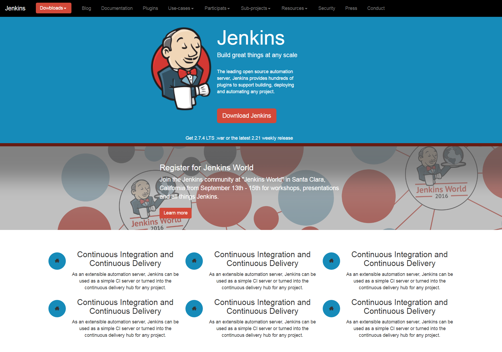

#framework_practice

## Description
There are various of practices of making web pages using page techniques like bootstrap,angularjs,css,html and so on. It is worth learning for beginners.
## Preview

 bootstrap_practice page

 bootstrap_practice2 page

 angularjs_practice page

 jqueryMobile_practice page

 html_practice page

 css_practice page

